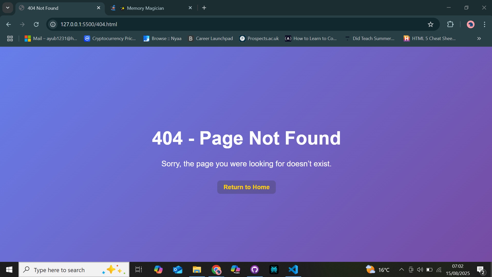

# Memory Magician

Memory Magician is an interactive web-based memory game designed to challenge and delight users of all ages. With a clean user interface, engaging card-flipping mechanics, and themeable categories, this project showcases modern front-end development using HTML, CSS, and JavaScript.

## Project Purpose

Memory Magician was developed as part of a diploma project to demonstrate core front-end skills, code cleanliness, UX awareness, and robust testing. The application’s purpose is to provide a real-world example of a professional-grade, responsive web game that prioritizes usability, user enjoyment, and code quality.

Memory Magician's target audience includes learners and casual gamers who enjoy fun cognitive challenges and want to experience an intuitive interface with immediate feedback.

## User Stories 

- **As a casual gamer,** I want an engaging and visually appealing memory game so that I can enjoy quick and fun cognitive challenges.  
- **As a learner,** I want multiple themed categories so I can expand my knowledge while playing.  
- **As a user with different devices,** I want the game to work smoothly on desktop, tablet, and mobile so that I can play anywhere.  
- **As a player,** I want immediate feedback on my matches and progress so that I feel motivated and informed.  
- **As a user with accessibility needs,** I want clear visuals, readable fonts, and keyboard navigation so that the game is inclusive.  
- **As a developer or tester,** I want clean, well-structured code and thorough testing so that the game is easy to maintain and reliable.  

## Features

- **Multiple Categories:** Switch between themed categories (e.g., Chemistry, Capitals, German) for varied game content.
- **Animated Card Flipping:** Smooth CSS-based transitions for user feedback.
- **Accessible, Responsive Design:** Works on desktops, tablets, and mobile devices, with consistent color contrast and styling.
- **Emoji & Image Fallbacks:** Ensures visual feedback across all platforms and themes.
- **Score Tracking:** Live stats for matches found, moves made, and time elapsed.
- **Feedback on Matches:** Bounce and wobble animations for matched pairs.
- **Victory Overlay:** Celebratory message on game completion.
- **User Controls:** Reset and change category at any point.

## UX Design & Accessibility

- **Clear visual hierarchy:** Game header, statistics, and board layout use structural markup and visible sectioning.
- **Intuitive Navigation:** Category buttons and controls are prominent.
- **Accessible Colors & Fonts:** All UI elements use contrasting backgrounds and fonts for readability.
- **Responsive Layout:** CSS grid and media queries ensure playability on all screens.
- **Keyboard Accessibility:** All controls and cards are navigable and actionable via keyboard.

For further details, wireframes and design diagrams are available in the `/docs/design/` folder.

## Setup & Installation

1. **Clone the Repository**
- git clone https://github.com/buya96/Memory-magician.git
- cd memory-magician

2. **Installation**
- No build step or dependencies required.
- All files are static HTML, CSS, and JavaScript.
- Images and icons should be placed in the `img/` directory as detailed in the README.

3. **Running Locally**
- Open `index.html` in your browser.
- The game runs in any modern browser.

## Testing & QA Process

Testing has been carried out using the following procedures:

- **Manual Testing:** Each feature and category was tested by playing through multiple rounds:
- Verified UI renders correctly across Chrome and Safari.
- Ensured responsive layout adapts on desktop, tablet, and mobile.
- Checked that all controls (reset, category change) perform expected actions.
- Verified that emoji and image fallbacks appear correctly for all categories and platforms.
- Used keyboard only to check accessibility.
- Inspected for semantic HTML, ARIA roles, and appropriate tab order.

- **Automated Validation:**
- HTML validated using [W3C Markup Validation Service](https://validator.w3.org/).
- CSS validated using [Jigsaw CSS Validator](https://jigsaw.w3.org/css-validator/).
- JavaScript passed through [JSLint](https://www.jslint.com/) 

- **Bug Tracking & Resolution:**
- **Issue:** Some emoji cards failed to render on specific browsers/platforms.
 **Resolution:** Added PNG fallback icons for critical categories.
- **Issue:** Overriding CSS specificity caused incorrect emoji display.
 **Resolution:** Reordered stylesheet rules and confirmed correct cascade.
- All identified issues have been documented and resolved; no known critical bugs remain.

## Testing Proof (with Screenshots)

Visual evidence of the game’s function and responsiveness across various devices and categories.  
All screenshots are located in the `/docs/screenshots/` directory.

### Desktop View on Chrome
  
Tested game rendering including layout, animations, and controls.

### Tablet View on Chrome
  
Responsive card grid adjusts properly; category changes work as expected.

### Mobile View on Safari
  
Smooth animations and accessible navigation confirmed on mobile.

### Chemistry Category
  
Emoji and PNG fallback icons display consistently.

### Capitals Category
  
Emojis render correctly without unwanted flag icons after updates.

### German Category
  
Image fallbacks for flags work as intended.

### 404 Error Page

Default 404 error page shown when an invalid route is visited.

## Deployment

The deployed application is publicly available on GitHub Pages:

- **Production URL:** [https://buya96.github.io/Memory-Magician/](https://buya96.github.io/Memory-Magician/)

### Deployment Procedure

1. Commit all code and documentation changes to main/master branch.
2. Push to GitHub repository.
3. Within repo settings, enable GitHub Pages for the `main` or `docs` branch.
4. Confirm deployment at public URL.
5. Ensure images and assets load correctly; verify no broken links.
6. README, design docs, and testing records are included in the live repository.

## Development Process & Version Control

- **Version Control:** All code managed via Git and GitHub:
- Small, descriptive commits per feature/fix.
- Branches created for major features; merged upon completion.
- Commits describe the change, e.g., “Fix emoji fallback for Capitals theme.”

- **Documentation:** 
- Full rationale for UI/UX decisions and testing included in this README and `/docs/`.
- Code and image assets are separated by file type and described in the directory structure.
- No commented-out code or unused assets in final deployment.

## Attributions & External Resources

- The favicon used in this project was generated with assistance from **Perplexity AI**.
- Special thanks to my **friends and family** for thoroughly testing the game on multiple devices and providing valuable screenshots.
- I am truly grateful to my mentor, **Tim**, for his ongoing guidance, encouragement, and support throughout this project.
- Some parts of the JavaScript code, especially the logic on **line 72 of `script.js`** (the card matching logic), were developed with valuable guidance from **Perplexity AI** to ensure functionality and clarity.
- Additionally, any complex JavaScript patterns or optimizations in the code that might be challenging for new learners were created with guidance from **Perplexity AI**.

## Contact & Support

For questions, bug reports, or to contribute:
- Email: [ayub1231@hotmail.com](mailto:ayub1231@hotmail.com)

